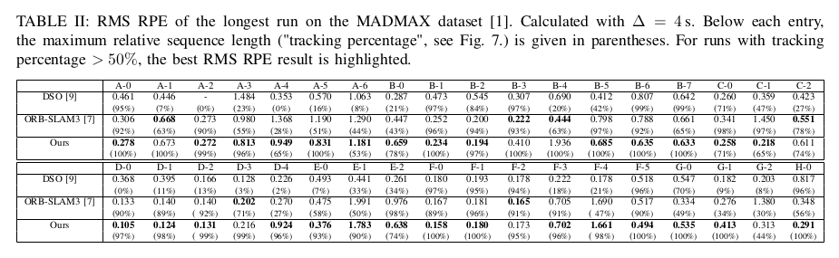

# granite

This will be the code repository of our visual odometry based on [basalt](https://vision.in.tum.de/research/vslam/basalt).
As soon as we have all permissions the code will be uploaded.

## Note to the Reviewers of IROS 2021 

After submitting our paper *Towards Robust Monocular Odometry for Flying Robots on Planetary Missions*, we realized that the most recent version of Tab. II on page 8 of has NOT been included, unfortunately. The RMS RPE values for DSO and ORB-SLAM3 are not correct as the trajectories results were not transformed into the IMU reference frame, for which ground-truth data is given in the MADMAX dataset. Also the additional information about tracking percentage is missing.
The correct version of Tab. II is shown below

